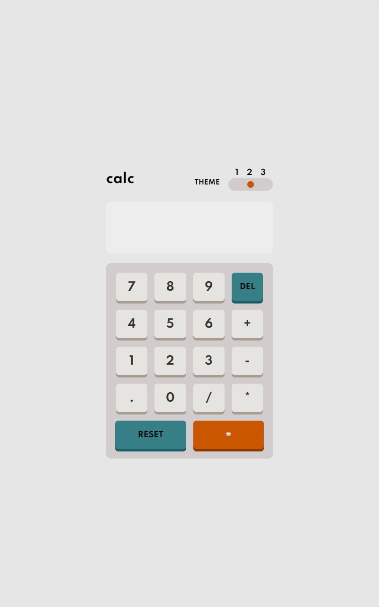

# Frontend Mentor - Calculator app

Esta é uma solução para o [calculator-app](https://www.frontendmentor.io/challenges/calculator-app-9lteq5N29). Os desafios do Frontend Mentor ajudam você a melhorar suas habilidades de codificação ao construir projetos realistas.

## Resumo de conteúdos

- [Visão Geral](#Visão-Geral)
  - [O desafio](#O-desafio)
  - [Captura de tela](#Captura-de-tela)
  - [Links](#Links)
- [Meu processo](#Meu-processo)
  - [Construído com](#Constrído-com)
  - [O que eu aprendi](#O-que-eu-aprendi)
  - [Continuação dos desenvolvimentos](#Continuação-dos-desenvolvimentos)
  - [Recursos utilizados](#Recursos-utilizados)
- [Autor](#Autor)

## Visão Geral.

### O desafio

Os usuários devem ser capazes de:

- Visualizar estados de foco para elementos interativos.
- Criação de uma calculadora.
- Observar um design responsivo.
- Observar os diferentes temas e suas mudanças de cores.
- Efeitos de cliquei nos botões da calculadora.

### Captura de tela

- Desktop
<p  align="center" >
  
</p>

- Tablet
<p  align="center" >

</p>

- Mobile
<p  align="center" >

</p>

- Gif
<p  align="center" >

</p>

### Links

- Solução URL: [https://github.com/michelwene/calculator-app](https://github.com/michelwene/calculator-app)
- Site URL: [https://michelwene.github.io/calculator-app/](https://michelwene.github.io/calculator-app/)

## Meu processo

### Construído com

- HTML5
- CSS3
- Flexbox
- Design responsivo
- EMMET
- JavaScript

### O que eu aprendi

```css
:root.them-1 {
  /*Theme 1*/
  /*Backgrounds*/
  --bg-body: hsl(222, 26%, 31%);
  --bg-keypad: hsl(223, 31%, 20%);
  --bg-screen: hsl(224, 36%, 15%);

  /*Keys*/
  --bg-delete: hsl(225, 21%, 49%);
  --shadow-delete: hsl(224, 28%, 35%);

  --toggle-key: hsl(6, 63%, 50%);
  --shadow-equals: hsl(6, 70%, 34%);

  --bg-key: hsl(30, 25%, 89%);
  --shadow-key: hsl(28, 16%, 65%);

  /*Text*/
  --color-number: hsl(221, 14%, 31%);
  --color-result: rgb(255, 255, 255);
  --key-del: rgb(255, 255, 255);
  --key-equels: rgb(255, 255, 255);
}

:root.them-2 {
  /*Theme2*/

  /*Backgrounds*/
  --bg-body: hsl(0, 0%, 90%);
  --bg-keypad: hsl(0, 5%, 81%);
  --bg-screen: hsl(0, 0%, 93%);

  /*Keys*/
  --bg-delete: hsl(185, 42%, 37%);
  --shadow-delete: hsl(185, 58%, 25%);

  --toggle-key: hsl(25, 98%, 40%);
  --shadow-equals: hsl(25, 99%, 27%);

  --bg-key: hsl(45, 7%, 89%);
  --shadow-key: hsl(35, 11%, 61%);

  /*Text*/
  --color-number: hsl(60, 10%, 19%);
  --color-result: hsl(0, 0, 100%);
  --key-del: rgb(255, 255, 255);
  --key-equels: rgb(255, 255, 255);
}

:root.them-3 {
  /*Theme 3*/

  /*Backgrounds*/
  --bg-body: hsl(268, 75%, 9%);
  --bg-keypad: hsl(268, 71%, 12%);
  --bg-screen: hsl(268, 71%, 12%);

  /*Keys*/
  --bg-delete: hsl(281, 89%, 26%);
  --shadow-delete: hsl(285, 91%, 52%);

  --toggle-key: hsl(176, 100%, 44%);
  --shadow-equals: hsl(177, 92%, 70%);

  --bg-key: hsl(268, 47%, 21%);
  --shadow-key: hsl(290, 70%, 36%);

  /*Text*/
  --color-number: hsl(52, 100%, 62%);
  --color-result: hsl(52, 100%, 62%);
  --color-text: rgb(255, 255, 255);
}
/*Este método de nomeção de váriaveis no css foi que proporcionou a troca dos temas na calculadora, nestas váriaveis eu criei os três temas de cores em que foi proposto, e dentro de cada váriavel ela carrega todas estas cores, sendo assim, quando eu troca essas variaveis e coloco elas na tag html, ela automaticamente muda as cores que tem inserida na váriavel.*/

.num:active {
  box-shadow: 0px 0px var(--shadow-key), inset 0px 5px var(--shadow-key);
  transform: translate(0px, 3px);
}

/*Este css diz respeito ao efeito de clique nos botões da calculadora, com este efeito, os botões ficaram muito mais realistas ao cliquei, ficou muito bom.*/
```

```javaScript
/*Calculator*/
let display = document.getElementById("display");

let button = Array.from(document.querySelectorAll("button"));

button.map((button) => {
  button.addEventListener("click", (e) => {
    switch (e.target.innerText) {
      case "RESET":
        display.innerText = "";
        break;

        case "=":
          if (display.innerText === "") {
            display.innerText = "Digite um número";
          } else {
            display.innerText = eval(display.innerText);
          }
          break;

      case "DEL":
        if (display.innerText === "Digite um número") {
          display.innerText = "";
        } else if (display.innerText) {
          display.innerText = display.innerText.slice(0, -1);
        }
        break;


      default:
        if (display.innerText === "Digite um número") {
          display.innerText = "" + e.target.innerText;
        } else {
          display.innerText += e.target.innerText;
        }
    }
  });
});

/*Esta função diz respeito as funções da calculadora, a primeira varialvel eu pego o display da calculadora atravez do getElementById, na segunda variavel eu pego todo os button (que diz respeito aos números e operadores da calculadora), e transformo isso tudo em um Array, atraves do Array.from, posteriormente fiz um map nesses arrays que recebe um button, e adicionei um evento de click neles, onde quando os mesmos recebem um click, dispara uma função, e embaixo fiz um switch para determinar as funcionaridades dos operadores em determinadas situações em que aparacer no decorrer do uso da calculadora.*/

/* Switch Theme*/
const themSwitcher = document.querySelectorAll(".them");
const defaultThem = localStorage.getItem("them") || "them-1";

setThem(defaultThem);
themSwitcher.forEach((button) => {
  button.addEventListener("click", (event) => {
    setThem(event.target.value);
  });
});

function setThem(them) {
  them = them || "them-1";
  document.documentElement.className = them;
  localStorage.setItem("them", them);
  themSwitcher.value = them;
}

/*Nesta função do javascript ela fica responsável por selecionar o tema que está atualmente no navegador, e de acordo com o click do usuário nos inputs dos switchers, a classe da tag html muda também, por exemplo, o tema atual é o them-1, quando o usuário clicar no número 2, a classe do html muda para theme-2, e assim sucessivamente.
Esta função eu aprendi muito, utilizei ForEach para percorrer as classes .them que recebe um button, e adicionei um evento de click neste botão e quando ele tem o click, ele dispara uma função.*/
```

### Continuação dos desenvolvimentos

Pretendo continuar fazendo projetos do FrontendMentor, para melhorar meu HTML, CSS, JavaScript.

### Recursos utilizados

- [Stackoverflow](https://stackoverflow.com/) - Este site me ajudou muito na realização das funções do javascript.
- [PerfectPixel](https://www.welldonecode.com/perfectpixel/) - Plugin do google Chrome utilizado para servir de refência na construção do layout, funciona mais ou menos como um FIGMA.
- [Developer Mozilla](https://developer.mozilla.org/en-US/docs/Web/JavaScript) - A documentação do Developer Mozilla é essencial para compreender as funções e conseguir aplicar as mesmas no projeto.

## Autor

- Frontend Mentor - [@michelwene](https://www.frontendmentor.io/profile/michelwene)
- Linkedin - [@michelwene](https://www.linkedin.com/in/michelwene/)
